# Хмарні рішення для IoT та IIoT.

## Послідовність обробки даних в хмарних сервісах IoT.

### Типовий шлях обробки.

При використанні хмарних платформ в архітектурі IoT, дані що збираються з Edge проходять певну обробку. Хмарні IoT сервіси розраховані на отримання великої кількості запитів на одиницю часу, що дає можливим побудувати розподілені системи IoT з тисячами джерел даних при цьому майже не втративши на швидкості обробки. Після отримання даних (Capture, див рис.1) відбувається їх первинна обробка, що включає певні розрахунки та переадресацію на наступний сервіс. Якщо крок «Capture» більше зосереджений на комунікаціях (наприклад MQTT чи HTTP), то «Process» - на логічному структуруванні даних та примітивній обробці (масштабування, агрегатування, тощо). Дані можуть об’єднуватися навколо сутностей типу «пристроїв» чи «цифрових двійників», що спрощує їх адміністрування. 

                               

Рис.1. Типовий шлях обробки даних в IoT.

Далі дані можуть передатися іншим сервісам, наприклад для збереження в різних сховищах: 

- під «Normal Storage» розуміється якась БД типу SQL або NONSQL, яка буде використовуватися різними сервісами для аналізу даних; 

- «Big Data Storage» - база даних спеціального формату, розрахована на роботу з даними великого об’єму;

- «Cloud offload» - це сховище поза межами хмари

- «Dashboard &Analytics» використовується для виведення даних в форматі онлайн-звітів. Під аналітикою розуміються звичайні сервіси статистичного аналізу, які не вимагають алгоритмів машинного навчання. Ці звіти як правило конфігуруються і не потребують програмування.

- «Long Term Storage» - використовується для довгострокового зберігання даних, які не потребують швидкого доступу та аналізу. 

- «Machine Learning» використовуються для складної обробки даних з використанням машинного навчання. 

[Відео](https://youtu.be/K0DUIVU0U9Y)    

### Приклад архітектури IoT Cloud

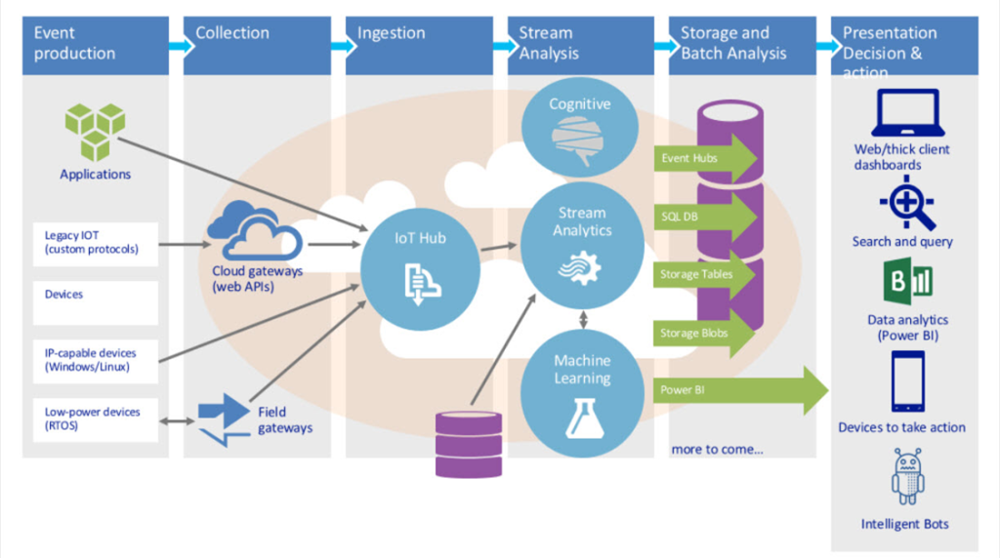

[відео](https://youtu.be/UUnTLQ3t3lM)

### Приклад Azure Services

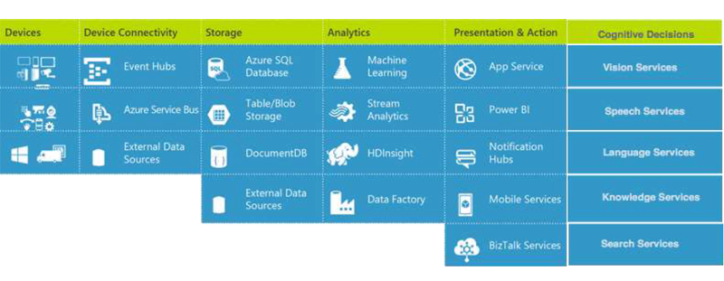

[відео](https://youtu.be/RyH2D4UDlU4)

### Process

Capture & store
Queueing
Streaming
Dispatch

Kafka
IoT Hubs’
Amazon Kinesis
Azure Event Hub
Cloud DataFlow

[відео](https://youtu.be/v7XGTKyzn1c)

### Capture

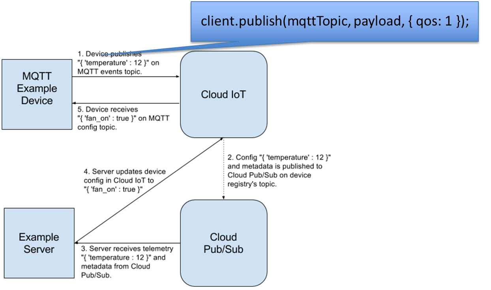

[відео](https://youtu.be/z9o_OSLfzMw)

### Sample

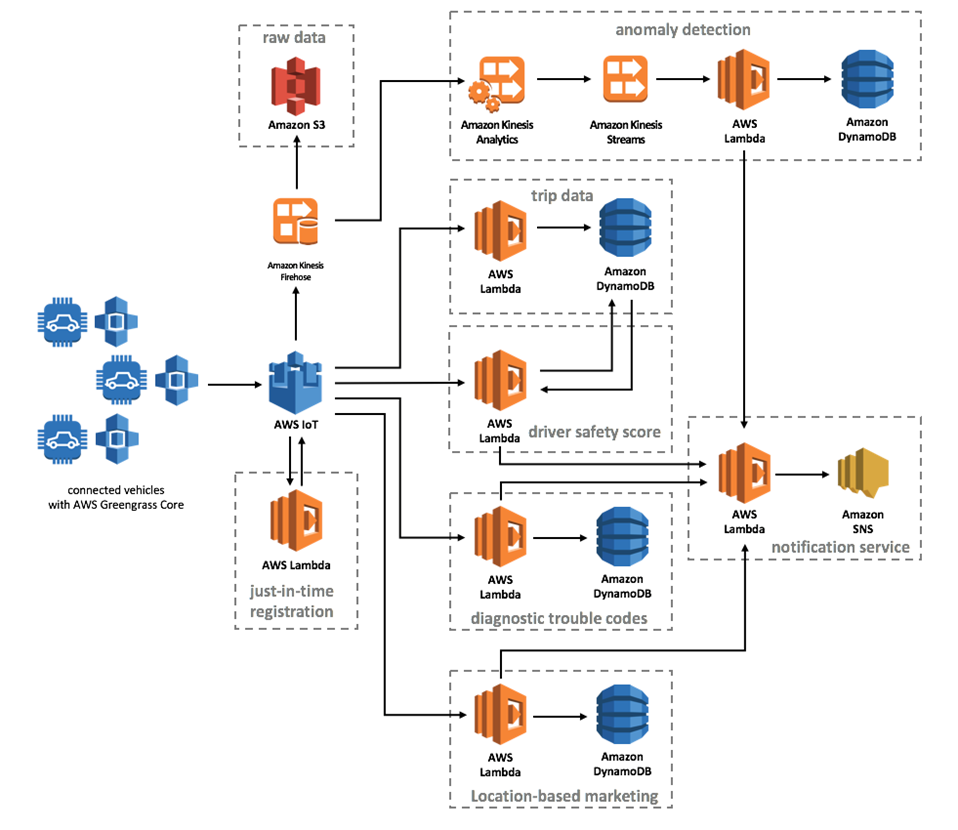

[відео](https://youtu.be/jsHByG4STkg)

### Analytics

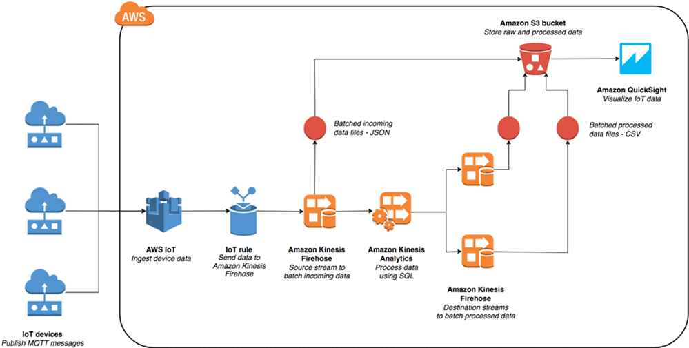

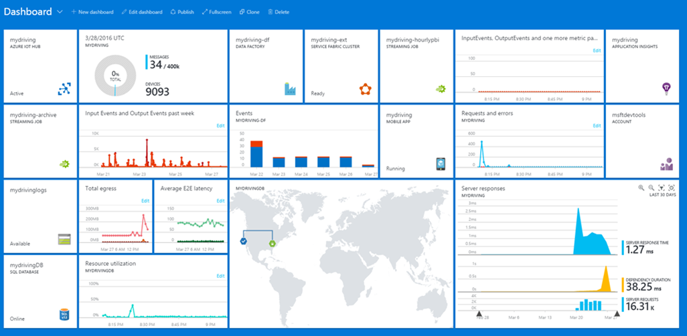

[відео](https://youtu.be/jvUlP_s9pfE)

### Machine learning

•Processes data using different machine learning algorithms
•Has a collection of already implemented algorithms
•Part of data processing pipeline
•Numeric, Textual, Visual, Audio, Signal
Numpy, Keras & TensorFlow and many other
Amazon SageMaker
Google Cloud Machine Learning Engine
Azure Machine Learning	

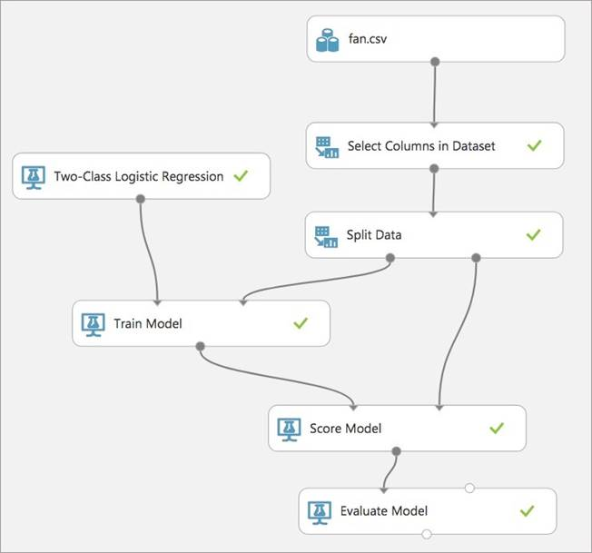

[відео](https://youtu.be/u53n4nbuTt0)

### IoT Edge Purpose

•Management of devices in the field
•High level features and configuration
•Significant simplification for typical scenarios and devices
•Moves part of compute to the device
•
•Cloud offerings
–AWS Greengrass 
–Azure IoT Edge
–Cloud IoT Edge

[відео](https://youtu.be/yHXpqD1jOzg)

### IoT Edge Key goals

- Cloud vs Local compute
- Local machine learning
- Works during offline
- Near real-time
- Integration with non-OS capable sensors

[відео](https://youtu.be/FAJx6wPooz4)

### Sample architecture (Azure)

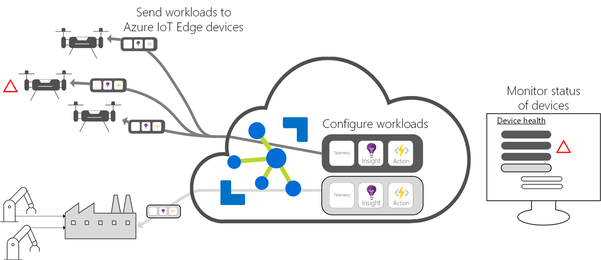

[відео](https://youtu.be/n0uS3CXoPck)

### Key modules (Google)

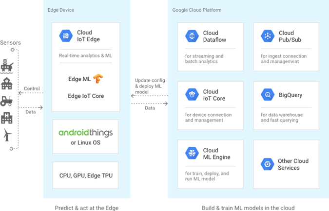

[відео](https://youtu.be/aZzBizwKitQ)

## Інтеграція АСКТП з хмарними сервісами

Шляхи інтеграції компонентів систем керування з хмарними платформами передусім залежать від необхідної задачі, яка вирішується, вибору хмарної платформи, служб, які вона надає і відповідно протоколів, які підтримуються цими службами. У ряді випадків достатньо забезпечити передачу архівних даних з певною періодичністю задля виконання звітів, у інших – дані повинні передаватися в режимі реального часу з можливістю онлайн аналізу та прийняття рішень на базі хмарних обчислень з використанням Data Mining.  Тут зосередимося на способах інтегрування засобів АСКТП, особливо SCADA/HMI з хмарними сервісами з використанням рішень IoT.

Більшість постачальників хмарних платформ надають засоби для реалізації та впровадження Інтернету речей [16](https://journals.onaft.edu.ua/index.php/atbp/article/view/878). Наприклад, Amazon Web Service пропонує комплексне рішення для реалізації Інтернету речей, а саме AWS IoT Core – це керована хмарна платформа, яка дозволяє підключеним пристроям просто і безпечно взаємодіяти з хмарними застосунками та іншими пристроями. Крім того, що хмарні сервіси надають значний функціонал для об’єднання пристроїв в загальну мережу та віддалене керування ними, важливим фактором для інтеграції з виробничим устаткованням та програмним забезпеченням є підтримуванні цими службами протоколи. AWS IoT Core підтримує протоколи HTTP, WebSockets і спрощений протокол зв'язку MQTT, спеціально спроектований для підтримки нестабільного підключення і роботи в мережах з низькою пропускною здатністю. Microsoft Azure в свою чергу пропонує комплексне рішення для Інтернету речей Azure IoT Suite. Компонент цього рішення розглянуто більш детально нижче. Рішенням від Google Cloud Platform виступає Google Cloud Web of Things (IoT) Core – це повністю керована служба для безпечного підключення та керування пристроями IoT. Подібні рішення пропонуються і IBM, причому спробувати їх значно простіше, оскільки в безкоштовній підписці вони не потребують реєстрації кредитної карточки. 

Вище згадані платформи відносяться до споживчих хмарних платформ. Існують також промислові хмарні платформи, які набагато глибше фокусуються на задачах ОТ. Вони розроблені таким чином, щоб забезпечувати збір та обробку даних під час функціонування виробничих процесів з метою підвищення продуктивності а також прогнозуючого обслуговування. Серед них GE Predix від GE Digital та MindSphere від Siemens AD. Ці рішення є комерційними, мають чітке промислове спрямування, простіші з точки зору використання, але можуть виявитися більш дорожчими, ніж звичайні споживчі хмарні платформи. Крім того, враховуючи, що більш застосовані споживчі платформи вже надають ресурси для реалізації промислових рішень, їх використання може бути більш доречним. Зокрема MS Azure вже надає можливість реалізації рішень націлених на виробництво. Слід відмітити, що індустріальну платформу GE Predix теж можна розгорнути в інфраструктурі Azure і наразі Microsoft та GE Digital ведуть переговори щодо співпраці, яка в майбутньому дасть змогу додаткам розгорнутим засобами MS Azure обмінюватися даними з Predix.

MS Azure вже зараз надає ресурси для реалізації промислового Інтернету речей та має дуже розвинену інфраструктуру. Крім того MS Azure підтримує технологію OPC UA, яка знаходиться на етапі становлення як передового стандарту для інтеграції промислового устатковання в єдину мережу. Нижче розглянемо приклади інтеграції з цією платформою в якості прикладу.

Значна кількість виробників апаратних та програмних засобів для АСК ТП на хвилі розвитку застосування промислового Інтернету речей мають намір залишатися конкурентоспроможними та не втрачати позиції на ринку. Як приклад, COPA-DATA для своєї SCADA zenon пропонує використання сервісів MS Azure для розгортання мобільних застосунків HMI клієнтів та WEB-сайтів для віддаленого моніторингу. Крім того, в хмарі можна розмістити інструментальний засіб для побудови звітів zenon Analyzer, що забезпечить скорочення локальних обчислювальних ресурсів та відкриту можливість доступу до звітів усім стейкхолдерам. Таке рішення вимагає самостійного використання платформи MS Azure як системи типу PaaS. 

Підрозділ AVEVA від Schneider Electric у свою чергу пропонує своє рішення для збору, візуалізації та аналізу промислових даних, яке представляє собою систему типу SaaS, побудовану засобами MS Azure. Це рішення – Wonderware Online InSight, яке дозволяє інтегруватися з такими продуктами як Wonderware InTouch HMI, Wonderware System Platform та Wonderware Historian. 

Однак не всі SCADA-програми мають вбудовані засоби інтегрування з хмарними платформами. Крім того, наявність великої кількості впроваджень потребують інших технологій інтегрування. Нижче ми розглянемо технології, які надають можливість об’єднати більшість рішень з хмарними платформами. Слід не забувати, що не всі технології варто використовувати повсякмісно, оскільки вибір може не дати очікуваних результатів за рядом критеріїв, або бути незахищеним з точки зору кібербезпеки. Тут ми зосереджуємося саме на можливостях, але упускаємо питання, пов’язані з вірністю вибору його реалізації.    

### **1.** **OPC UA** **в** SCADA/HMI. 

Найбільш сучасною інтеграційною технологією в промисловій автоматизації є OPC UA, яка є крос-платформною і більше не базується на технології DCOM. OPC UA Server може бути як в SCADA так і в ряді HMI .

Сьогодні існує кілька можливих варіантів підключення OPC UA та MS Azure через програмний шлюз. Запуск програмних шлюзів можливий на різноманітних операційних системах та апаратних пристроях, включаючи віртуальні машини у хмарах. З боку MS Azure рекомендується використовувати такі служби: IoT Hub, Event Hubs, Azure Service Bus. Вони підтримують протоколи AMQP, MQTT i HTTP і побудовані для отримання даних у великій кількості. IoT Hub, крім того, забезпечує керування пристроєм та двостороннє спілкування. Розглянемо деякі пропозиції щодо інтеграції OPC UA з MS Azure. 

Першим можливим варіантом реалізації передачі даних в хмарну платформу MS Azure зі SCADA-програми або PLC, які підтримують OPC UA, є розробка власного програмного шлюзу (рис.9.35). Написання власного шлюзу OPC UA для програмістів є відносно нескладною задачею завдяки відкритій версії OPC UA.NET Standard library та прикладам, що надає OPC Foundation. Крім того є відкриті бібліотеки AMQP для багатьох мов програмування. Тим не менше це вимагає від інтегратора наявність персоналу з відповідними компетенціями в об’єктно-орієнтованому програмуванні. 

рис.9.35. Передача даних зі SCADA-програми в хмару MS Azure з використанням програмного шлюзу Azure IoT Edge Gateway

Другим варіантом реалізації шлюзу є використання Azure IoT Edge Gateway. Azure IoT Edge Gateway є крос-платформенним і використовує модульну архітектуру. У відкритому доступі знаходять різноманітні модулі, в тому числі OPC UA Publisher. Перевага підходу Azure IoT Edge Gateway полягає в тому, що при цьому використовується проект із відкритим кодом, який підтримують (включаючи Microsoft) та застосовують інші користувачі, а також даний підхід реалізує масштабовану, розширювану крос-платформну архітектуру. Приклад реалізації даного підходу інтеграції наведений на рис.9.36. У даному варіанті розглядається взаємозв’язок між компонентами системи, а саме SCADA-програмою та службою MS Azure IOT HUB. SCADA-програма має інтегрований OPC UA сервер, служба IOT HUB зберігає та оброблює дані від різних пристроїв, забезпечує підтримку протоколів AMQP, MQTT i HTTP поверх TLS, а також надає різні можливості для оперування отрима­ними даними (проведення аналітики) та їх подальшого використання іншими службами, наприклад, розгортання OPC UA клієнтів в хмарі. Такий взаємозв’язок реалізується за допомогою встановлення програмного пакету Azure IoT Edge Gateway з боку функціонування SCADA-програми. Так як шлюз має модульну структуру, то для встановлення зв’язку шлюзу з OPC UA сервером необхідно в його програмний код включити модуль OPC UA Publisher, який функціонує на базі стеку OPC UA.NET Standard library. Azure IoT Edge Gateway вже включає бібліотеки AMQP, MQTT i HTTP, тому передача даних реалізовується за допомогою цих протоколів. Також замість модуля OPC UA Publisher можна використовувати модуль Azure IoT Edge OPC Reverse Proxy для реалізації двостороннього зв’язку. 

 

 

рис.9.36. Передача даних зі SCADA-програми в хмару MS Azure з використанням програмного шлюзу Azure IoT Edge Gateway

### **2.** **OPC DA** **в** **SCADA** **на** OPC UA 

Якщо програмні засоби (SCADA) або пристрої не підтримують OPC UA можна використовувати готові програмні шлюзи OPC DA/UA. Як приклад, Matrikon OPC UA Tunneller дозволяє клієнтським додаткам з підтримкою OPC UA спілкуватися з OPC Classic серверами та клієнтами, і навпаки. Як альтернативу також можна використовувати UaGateway Wrapper & Proxy. UAGateway є застосунком, що працює в операційній системі Windows (XP, Vista, Win7). Альтернативою відкритим програмним шлюзам є комерційні шлюзи з закритою архітектурою (чорна скринька), де постачальник сам реалізовує і підтримує шлюзування між SCADA-програмою та службою MS Azure. Основна перевага використання комерційних шлюзів – це їх підтримка постачальниками.

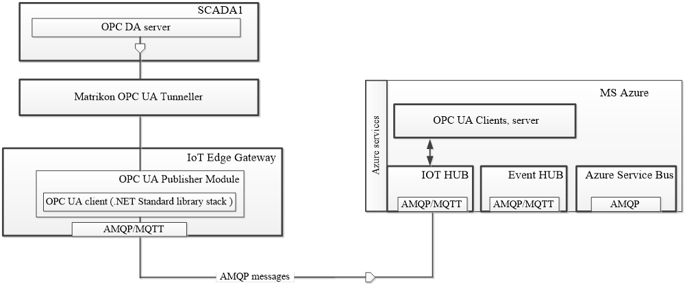 

рис.9.37. Передача даних зі SCADA-програми з інтегрованим OPC DA сервером в хмару MS Azure з використанням програмного шлюзу Azure IoT Edge Gateway

### **3. Інтерфейси** DB 

Поряд з OPC SCADA-програми тим чи іншим способом послуговуються відкритими технологіями ODBC, OLEDB та ADO.NET для обміну з СУБД. Механізми передачі даних зі SCADA-програм в локальні бази даних SQL зокрема через MS SQL Server є достатньо відпрацьованими. У цьому випадку задача інтеграції зводиться до переміщення даних з локальної бази даних MS SQL у базу даних SQL Azure. Існує рішення, яке дозволяє зв'язувати дані між локальним сервером MS SQL та базою даних SQL Azure шляхом їх синхронізації (рис.9.38). Засіб керування, що надається для синхронізації даних Microsoft SQL Data Sync Agent, передбачає вибір бази даних і таблиці, які необхідно синхронізувати, а потім створює завдання служби агента SQL Server для автоматичної синхронізації даних з SQL Azure за розкладом. При цьому максимальна частота синхронізації може досягати 5 хвилин. Ця технологія дозволяє розширити існуючу локальну інфраструктуру для роботи в хмарі. Завдяки зв'язуванню локальних даних з хмарною інфраструктурою можна легко налаштувати обмін інформацією з мобільними користувачами, віддаленими джерелами даних, при цьому використовуючи переваги нових служб в хмарі. Ця технологія також створює міст, який забезпечує взаємодію між локальними і віддаленими програмами. 

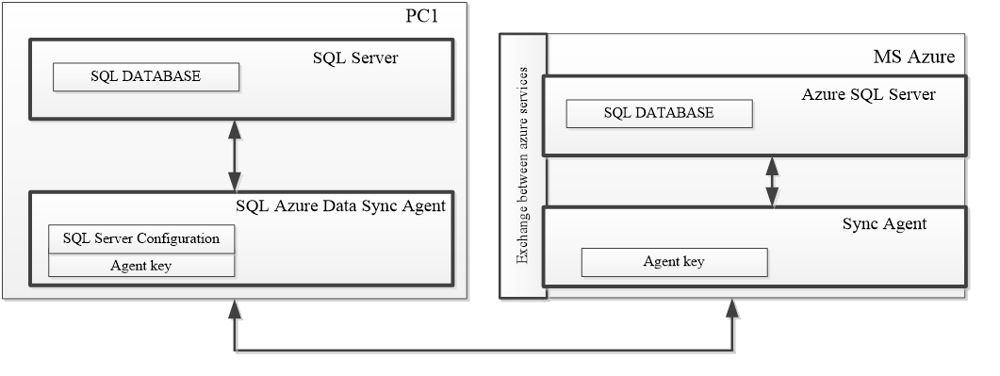 

рис.9.38. Синхронізація даних локальної бази даних MS SQL сервер та бази даних Azure SQL

Слід також відмітити, що при наявності драйверів ODBC чи провайдерів даних OLEDB до хмарних сховищ, питання інтегрування вирішується аналогічно як це розглянуто в параграфі 9.1.6. 

### **4.** **MQTT** **на** Edge Device

Вище були представлені шляхи інтегрування SCADA-програм з хмарною платформою MS Azure, проте впровадження підходів Індустрії 4.0 передбачає участь всіх активів в єдиній загальній мережі. Активними учасниками процесу керування в АСКТП є ПЛК, який може підтримувати різноманітні промислові протоколи, такі як Profibus, EtherCAT, Modbus, EtherNet/IP, CAN, CANopen і т.п. З іншого боку, сервіси IoT хмарних платформ підтримують протоколи AMQP, MQTT, HTTP та інші. Протокол MQTT є досить простим, тому вже зараз його підтримка є у багатьох ПЛК. Якщо протокол не підтримується розробником ПЛК, його можна реалізувати самостійно. Бібліотека таких «смописних» блоків вже є у відкритому доступі для ряду контролерів, наприклад, Siemens S7-300/S7-400 в середовищі програмування Step7. Маючи відкритий код неважко перенести його на інші платформи, що мають відкритий стек TCP/IP, наприклад з підтримкою CoDeSys. Однак слід черговий раз зауважити, що пряме з’єднання з Інтернетом ПЛК може бути небезпечним, тому рекомендується використовувати IIoT Edge Gateway. Крім того, «самописні» реалізації протоколів можуть мати ряд вад за які постачальник ПЛК не несе відповідальності. 

### **5.** **OPC** **на** Edge Device 

Враховуючи що OPC UA набирає обертів як передовий стандарт IIoT комунікації, його все більше впроваджують на рівні контролерів. Велика кількість виробників, наприклад, ABB, Bosch Rexroth, B&R, CISCO, GE Digital, KUKA, National Instruments (NI), Parker Hannifin, Schneider Electric, SEW-EURODRIVE та TTTech оголосили про співпрацю під егідою IIC та OPC Foundation. Ці компанії прагнуть до відкритої, уніфікованої, заснованої на стандартах комунікації в режимі реального часу між промисловими контролерами і хмарою. Вони приймають стандарт OPC UA, як єдиний для промислової автоматизації та зв'язку IIoT. На сьогоднішній день вже в багатьох контролерах інтегровано OPC UA server: Siemens S7-1500, Modicon M241 та M251 від Schneider Electric, PACSystems RX3i 320 CPU від GE Digital та інші. У якості шлюзу до MS Azure може використовуватись програмно-апаратний засіб, зроблений наприклад на промисловому комп’ютері з низьким споживанням.

### 6. **Edge Gateway + Node-RED 

В якості ще одного інструменту інтеграції PLC, SCADA/HMI та MS Azure можна використовувати інструмент потокового програмування – Node-RED. Він надає редактор налаштування потоків, який працює на основі браузера та дозволяє зручним способом зв'язати пристрої, які мають різні комунікаційні можливості, між собою. Node-RED побудований на легкій та ефективній програмній платформі Node.js, що дозволяє використання Node-RED як на недорогих апаратних пристроях таких як Raspberry Pi, так і в хмарі. В бібліотеці на сайті Node-RED можна знайти різні «nodes», за рахунок яких можна забезпечити встановлення зв'язку між пристроями, що використовують різні протоколи.

На сьогодні Node-RED є стандартом де-факто і є невід’ємною частиною пристроїв, що позиціонуються як IoT шлюзи. Цей графічний інструмент дещо нагадує мову FBD, тому спеціалісти з автоматизації достатньо легко зможуть його використовувати для різних здач перетворення та логічної обробки. У відкритій бібліотеці доступна для використання велика кількість вузлів і з кожним роком вона поповнюється новими. Там є підтримка великої кількості протоколів промислових мереж і звісно MQTT, HTTP, WebSocket та інших. Зрештою, це самий універсальний спосіб інтегрування з усіма засобами автоматизації, хоч і потребує певного графічного «програмування». Так, наприклад для обміну даними в реальному часі можна використовувати WebSocket а не MQTT, який більш адаптований до цього, хоч і потребує наявного постійного з’єднання. 

Таким чином, існуючі рішення автоматизації зі світу Індустрії 3.0 можуть бути модернізовані для переходу на новий рівень розвитку. Варто відзначити що ці рішення як правило не передбачають заміну, а радше модернізацію, що дуже важливо з огляду на необхідність неперервної роботи виробництва. Запропоновані вище рішення є практичними і ними можна користуватися вже зараз. 