# Інтернет речей

## Про Інтернет речей.

[Інтерне́т рече́й](https://uk.wikipedia.org/wiki/Інтернет_речей) (англ**. Internet of Things**, **IoT**) — концепція мережі, що складається із взаємозв'язаних фізичних пристроїв, які мають вбудовані давачі, а також програмне забезпечення, що дозволяє здійснювати передачу і обмін даними між фізичним світом і комп'ютерними системами, за допомогою використання стандартних протоколів зв'язку. Окрім датчиків, мережа може мати виконавчі пристрої, вбудовані у фізичні об'єкти і пов'язані між собою через дротові чи бездротові мережі. Ці взаємопов'язані пристрої мають можливість зчитування та приведення в дію, функцію програмування та ідентифікації, а також дозволяють виключити необхідність участі людини, за рахунок використання інтелектуальних інтерфейсів.

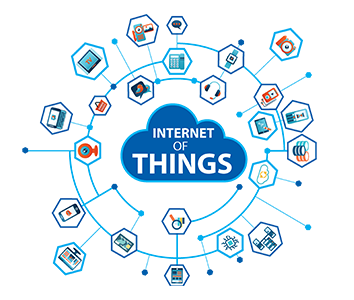

Набуває поширення також термін англ. Internet of Everything, IoE — всеохопний, або всеосяжний інтернет. Це явище спричинило занепокоєння в конфіденційності інформації й сприяло появі нового терміну безпека інтернету речей.

## Історія Інтернету Речей.

Термін «інтернет речей», зобов'язаний своєю появою Кевіну Ештону, який в 1997 р, працюючи на компанію Proctor and Gamble, застосував технологію **радіочастотної ідентифікації** (**RFID**) для керування системою поставок. Завдяки цій роботі в 1999 році його запросили в Масачусетський технологічний інститут, де він з групою однодумців організував дослідний консорціум Auto-ID Center (більш детальну інформацію можна знайти на [сайті]([www.smithsonianmag.com/innovation/kevin- ashton- describes-the-internet-of-things-180953749](http://www.smithsonianmag.com/innovation/kevin- ashton- describes-the-internet-of-things-180953749))). З тих пір Інтернет речей звершив перехід від простих радіочастотних міток до екосистеми і індустрії. Аж до 2012 р ідея підключення речей до Інтернету переважно відносилася до смартфонів, планшетів, ПК і ноутбуків. По суті, до тих пристроїв, які в усіх відношеннях виступають в якості комп'ютера. До цього, з моменту появи перших боязких зачатків Інтернету (таких як створена в 1969 р мережу ARPANET), більшості технологій, на яких будується Інтернет речей, просто не існувало. 

До 2000 року більшість пристроїв, які можна було підключити до Інтернету, представляло собою комп'ютери різних розмірів. Нижче показаний поступове підключення речей до Інтернету. 

·     1973 - Маріо У. Кардулло отримує патент на першу радіо-частотну мітку 

·     [1982](http://www.cs.cmu.edu/~coke/history_long.txt) - Підключений до Інтернету автомат з газованою водою в університеті Карнегі-Меллон

·     1989 - Підключений до Інтернету тостер на конференції Interop '89

·     [1991](hpmuseum.net/display_item.php?hw=350) - Компанія HP представила HP LaserJet IIISi: перший підключений до мережі Ethernet мережевий принтер

·     [1993](http://www.cl.cam.ac.uk/coffee/qsf/coffee.html) - Підключена до Інтернету кавоварка в Кембриджському університеті (перша підключена до Інтернету камера)

·     [1996](en.wikipedia.org/wiki/OnStar) - Підрозділ General Motors OnStar (дистанційна діагностика 2001)

·     [1998](https://www.bluetooth.com/about-us/our-history) - Поява організації Bluetooth SIG

·     [1999](https://www.telecompaper.com/news/lg-unveils-internetready-refrigerator--221266) - Холодильник LG Internet Digital DIOS

·     [2000](https://www.youtube.com/watch?v=U2AkkuIVV-I) - Перші прояви розробленої компанією HP концепції всепроникної комп'ютеризації (Cooltown): HP Labs, система обчислювальних і комунікаційних технологій, які в поєднанні один з одним створюють підключення до Інтернету для людей, місць і об'єктів

·     [2001](http://edition.cnn.com/2001/BUSINESS/asia/04/17/tokyo.kddibluetooth/index.html) - Випуск першого пристрою, що використовує технологію Bluetooth: мобільний телефон KDDI з підтримкою Bluetooth

·     [2005](http://www.itu.int/osg/spu/publications/internetofthings/InternetofThings_summary.pdf) - Міжнародний союз електрозв'язку, спеціалізована установа ООН, випустив звіт, в якому вперше були сформульовані прогнози розвитку Інтернету речей

·     [2008](https://www.omaspecworks.org/) - Поява першого IoT-спільноти IPSO Alliance, метою якого було сприяння підключенню речей до Інтернету

·     [2010](http://www.bu.edu/smartlighting/files/2010/01/BobK.pdf) - Успішна розробка напівпровідникових світлодіодних ламп привела до розвитку концепції розумного освітлення

·     [2014](https://support.apple.com/ru-ru/HT202880) - Компанія Apple створила протокол iBeacon для маячків 

Інтернет речей захопить практично кожен сегмент в сфері промисловості, бізнесу, охорони здоров'я і споживчих товарів. 

 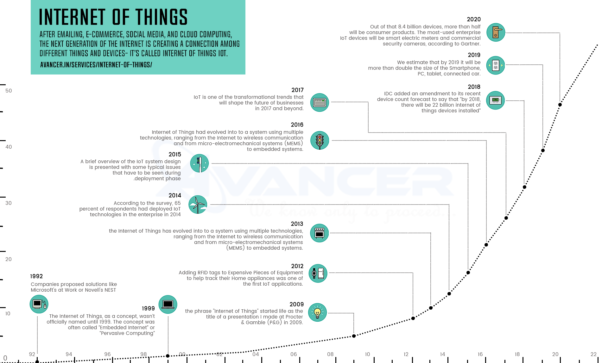

## Інтернет речей в промисловості.

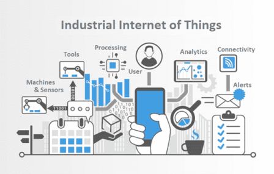

**Промисловий Інтернет речей** (**Industrial IoT**, **IIoT**) - це один з найбільш великих сегментів Інтернету речей з точки зору кількості підключених пристроїв і ступеня корисності цих сервісів для виробництва і автоматизації підприємств. Цей сегмент традиційно служить операційно-технологічною базою. Сюди входять апаратні і програмні засоби моніторингу фізичних пристроїв. Традиційні завдання інформаційних технологій вирішуються інакше, ніж операційно-технологічні завдання. **Операційні технології** (**ОТ**) зосереджені на оцінці продуктивності, часу безвідмовної роботи, зборі даних і відповідної реакції в режимі реального часу, а також безпеки систем. Інформаційні технології спрямовані на безпеку, групування, сервіси та надання даних. Оскільки Інтернет речей починає займати важливе місце в сфері виробництва і промисловості, світи ІТ і ОТ об'єднаються, особливо в області діагностичного обслуговування тисяч виробничих машин і верстатів, і зможуть забезпечувати безпрецедентним обсягом даних приватні та публічні хмарні інфраструктури.
 До характеристик цього сегмента відноситься необхідність надавати операційно-технологічної системи готові рішення в режимі реального часу або майже в режимі реального часу. Це означає, що у всьому, що стосується виробничого цеху, головним параметром для Інтернету речей буде час відгуку. Крім того, важливу роль будуть грати тривалість простою і безпеку. Це має на увазі потребу в запасі потужності і, ймовірно, в наявності приватних хмарних мереж і сховищ даних. Промисловий Інтернет речей - це один з сегментів на цьому ринку що найбільш швидко розвивається. Важливою особливістю цього напрямку є те, що він спирається на старі технології, тобто на апаратні і програмні засоби, які не можна назвати актуальними. Часто 30-річні виробничі станки працюють на послідовних інтерфейсах RS485, а не на сучасній бездротовій комірчастій архітектурі.

Приклади застосування Промислового Інтернету Речей.

- профілактичне обслуговування промислового обладнання;
- зростання продуктивності завдяки попиту в реальному часі;
- енергозбереження;
- системи безпеки, такі як вимірювання температури, вимірювання тиску і контроль над витоком газу;
- експертна система для виробничого цеху.

## Екосистема Інтернету речей

До екосистеми Інтернету речей відносяться усі засоби, сервіси і технології, які використовуються в Інтернеті речей. 

До них можна віднести:

·     **sensors (розумні датчики/виконавчі механізми****)**: вбудовані системи, операційні системи реального часу, джерела безперебійного живлення, мікро-електромеханічні системи (МЕМС);

·     **системи зв'язку з датчиками**: зона охоплення бездротових персональних мереж становить від 0 см до 100 м. Для обміну даними між датчиками застосовуються низькошвидкісні малопотужні інформаційні канали, які часто побудовані не на протоколі IP;

·     **локальні обчислювальні мережі (****LAN)**: зазвичай це системи обміну даними на основі протоколу IP, наприклад, 802.11 Wi-Fi-мережу для швидкої радіозв'язку, часто це пирингові або зіркоподібні мережі;

·     **агрегатори, маршрутизатори** **(routers), шлюзи** **(gateways), пограничні пристрої (****Edge Device)** : постачальники вбудованих систем, самі бюджетні складові (процесори, динамічна оперативна пам'ять і система зберігання даних), виробники модулів, виробники пасивних компонентів, виробники тонких клієнтів, виробники стільникових і бездротових радіосистем, постачальники міжплатформового програмного забезпечення, розробники інфраструктури туманних обчислень, інструментарій для граничної аналітики, безпеку граничних пристроїв, системи управління сертифікатами;

·     **глобальна обчислювальна мережа**: оператори стільникового зв'язку, оператори супутникового зв'язку, оператори малопотужних глобальних мереж (Low- Power Wide-Area Network, LPWAN). Зазвичай застосовуються транспортні протоколи Інтернету для IoT і мережевих пристроїв (MQTT, CoAP і навіть HTTP);

·     **хмара**: інфраструктура в якості постачальника послуг, платформа в якості постачальника послуг, розробники баз даних, постачальники послуг потокової і пакетної обробки даних, інструменти для аналізу даних, програмне забезпечення в якості постачальника послуг, постачальники озер даних, оператори програмно-визначених мереж / програмно-визначених периметрів, сервіси машинного навчання;

·     **сервіси аналізу даних**: величезні масиви інформації передаються в хмару. Робота з великими обсягами даних і отримання з них користі - це завдання, що вимагає комплексної обробки подій, аналітики і прийомів машинного навчання;

·     **безпека (****security)**: при зведенні всіх елементів архітектури воєдино постають питання кібербезпеки. Безпека стосується кожного компонента: від датчиків фізичних величин до ЦПУ і цифрового апаратного забезпечення, систем радіозв'язку і самих протоколів передачі даних. На кожному рівні необхідно забезпечити безпеку, достовірність і цілісність. У цьому ланцюзі не повинно бути слабких ланок, оскільки Інтернет речей стане головною мішенню для атак хакерів в світі.

## Архітектура Інтернету Речей

Архітектура Інтернету речей відрізняється в залежності від реалізації. Тим не менше вона дещо схожа на архітектуру класичних систем АСУТП. Один із прикладів архітектури показаний на рис.1. 

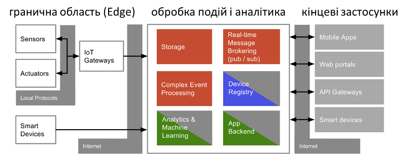

рис.1. 

Взаємодія з «речами» відбувається через датчики (sensors) та виконавчі механізми (Actuators), аналогічно як це робиться в АСУТП для будь якого об’єкту керування. Ці датчики разом з усією інфраструктурою для інтеграції з рівнем обробки подій через мережу Internet формують так звану граничну область (**Edge**). 

Події (дані) що поступають з граничної області зберігаються і обробляються відповідно до задачі (рівень обробки подій і аналітики, **event processing**, **Platform**). На цьому рівні події(дані) зберігаються (storage), обробляються (Event Processing), перенаправляються потрібним додаткам (Real-Time Message Brokering, Stream Processing). Додатково на цьому рівні відбувається адміністрування та керування пристроями з граничної області (Device Registry, Edge Device Management). Події (дані) обробляються з використанням аналітичних сервісів (Analytics) на основі них проводиться машинне навчання (Machine Learning), що дозволяє зробити певні висновки про об’єкт. Цей рівень як правило реалізований з використанням хмарних (Cloud) або туманних (Fog) обчислень. Якщо провести аналогію с АСУТП, то це рівень контролерів та SCADA (за виключенням функцій HMI).     

Отримання результатів, контроль, віддалене керування та адміністрування системи проводиться через кінцеві застосунки з використанням Internet. Цей рівень можна умовно порівняти з HMI в АСУТП.  

На рис.2. показана подібна наведеній вище архітектура, однак у вигляді сервісів. На ньому область Edge представлений у вигляді датчиків (Sensors), Device Hub/Gateway (збір та маршрутизація даних) та Device Management (керування пристроями). Останні частково виконуються як хмарні обчислення так і на граничних пристроях. Усі функції збереження та первинної обробки подій (даних) зведені до Data Management. Усі інші функції обробки, в тому числі аналітичні показані як додатки PaaS, що взаємодіють з сервісами керування даних через API (Application Program Interface).     

рис.2.

Ще один приклад архітектури Інтернету Речей показаний на рис.3. Як видно, усі наведені архітектури мають спільні риси: наявність трьох рівнів, подібні функції, наявність хмарних обчислень, використання Інтернету як інтеграційного рівня.  

Далі коротко розглянемо основні компоненти архітектури. 

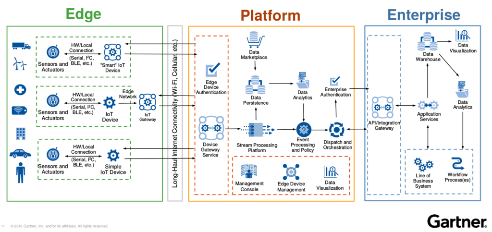

### Датчики та живлення

Інтернет починається або закінчується однією подією: простий рух, зміна температури або, може бути, важіль замикає замок. На відміну від багатьох існуючих ІТ-пристроїв, Інтернет речей здебільшого пов'язаний з фізичною дією або подією. Він формує реакцію на якийсь фактор реального світу. Іноді при цьому один-єдиний датчик може згенерувати величезний обсяг даних, наприклад, акустичний датчик для профілактичного огляду обладнання. В інших випадках всього одного біта даних достатньо, щоб передати життєво важливі відомості про стан здоров'я пацієнта. Якою б не була ситуація, системи датчиків еволюціонували і, відповідно до закону Мура, зменшилися до субнанометрових розмірів і стали істотно дешевше. Саме до цього апелюють ті, хто прогнозує, що до Інтернету речей будуть підключені мільярди пристроїв, і саме тому ці прогнози виправдаються.

Тому, розглядаючи Інтернет Речей, необхідно розглядати мікроелектромеханічні системи, датчики і інші типи недорогих граничних пристроїв і їх електрофізичних властивостей. Також це стосується силових і енергетичних систем, необхідних для живлення цих граничних пристроїв. Не можна вважати, що граничні пристрої забезпечуються енергією за замовчуванням. Мільярди маленьких датчиків все одно потребують великої кількості енергії. З питанням живлення також пов’язані питання організації хмарних сервісів IoT.

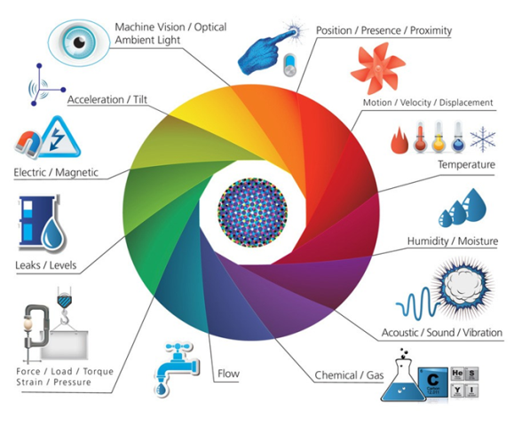

### Передача даних

Велика увага при розробці IoT приділяється встановленню з'єднання і роботі мереж.  Інтернету речей не існувало б без надійних технологій передачі даних з найвіддаленіших і несприятливих областей в найбільші центри збору даних компаній Google, Amazon, Microsoft і IBM. Словосполучення «Інтернет речей» містить слово «Інтернет», тому необхідно вивчати питання, що стосуються мережних технологій, обміну даними та навіть теорії сигналів. Базова опора Інтернету речей - це не датчики і не програми, а можливість встановити з'єднання. 

Передача даних і встановлення мережевого з'єднання базуються на базі систем зв'язку ближньої дії - персональних мереж (PAN), зазвичай побудованих без дотримання правил IP-протоколу. Це може бути як дротові так і бездротові мережі. До бездротових IoT-мереж/протоколів як правило відносяться протоколи Bluetooth, mesh-мережі, Zigbee, Z-Wave. Для IIoT це також Wireless Hart та ISA100. Це яскравий приклад різноманіття бездротових систем зв'язку IoT.  Перелік дротових мереж ще більший, так як сюди входять усі можливі промислові мережі та протоколи. 

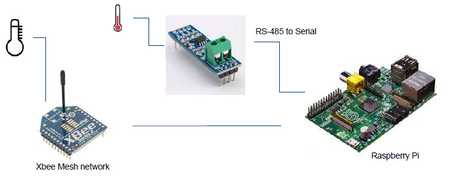

Крім PAN використовуються бездротові локальні мережі та системи зв'язку на основі IP-протоколу, включаючи широкий діапазон Wi-Fi-мереж на основі стандартів IEEE 802.11, 6LoWPAN і технології Thread. Нерідко використовуються телекомунікації на основі стільникових стандартів (3G, 4G LTE) і нові стандарти, що забезпечують роботу Інтернету речей і міжмашинної взаємодії, такими як Cat-1 і Cat-NB, а також пропрієтарні протоколи LoRaWAN і Sigfox, що використовуються саме для IoT.

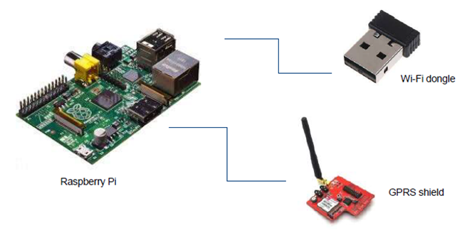

### Маршрутизація

Для передачі даних від датчиків в Інтернет-простір необхідні дві технології: маршрутизатор-шлюз і опорні інтернет-протоколи, що забезпечують ефективність обміну даними. Маршрутизатор особливо важливий в таких аспектах, як безпека, управління і напрям даних. Граничні маршрутизатори (Edge routers) керують і стежать за станом відповідних mesh-мереж, а також вирівнюють і підтримують якість даних. Також велике значення належить конфіденційності та безпеки даних. Маршрутизатор відіграє важливу роль в створенні віртуальних приватних мереж, віртуальних локальних мереж і програмно-визначених глобальних мереж. Вони в буквальному сенсі можуть містити тисячі вузлів, що обслуговуються єдиним граничним маршрутизатором, і в якійсь мірі маршрутизатор служить розширенням для хмари (edge device).

На цьому рівні використовується ряд протоколів, необхідних для обміну даними між вузлами, маршрутизаторами і хмарними сервісами в межах IoT-системи. Інтернет речей відкрив дорогу новим IoT-протоколам, які виходять на один рівень з традиційними протоколами HTTP і SNMP, які застосовуються вже кілька десятків років. Для передачі IoT-даних потрібні ефективні, енергозберігаючі протоколи з малою затримкою, здатні легко і безпечно відправляти дані в хмару і з нього. Зокрема тут використовуються такі протоколи, як всюдисущий MQTT, AMPQ і CoAP.

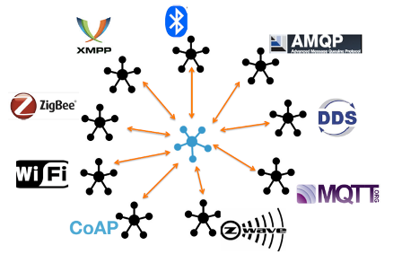

##  Туманні і граничні обчислення, аналітика і машинне навчання

На цьому етапі необхідно вирішити, що робити з потоком даних, що надходять в хмарний сервіс з граничного вузла (Edge Device). Щоб навчитися правильно оцінювати, як система буде розвиватися і рости, необхідно розібратися у всіх тонкощах і складнощах архітектури хмарних систем, який вплив на IoT-систему робить запізнювання. Крім того, не все треба відправляти в хмару. Пересилання всіх IoT-даних обходиться значно дорожче, ніж їх обробка на кордоні мережі (граничні обчислення, Edge Computing) або включення граничного маршрутизатора в зону, яку обслуговує хмарний сервіс (туманні обчислення, Fog computing). Туманні обчислення також стандартизуються, зокрема є стандарт туманних обчислень, наприклад архітектура OpenFog.

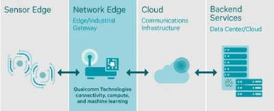

Дані, які були отримані шляхом перетворення аналогового фізичного впливу в цифровий сигнал, можуть мати велику вагу. Саме тут в гру вступають засоби аналітики і процесори правил IoT-системи. Ступінь складності введення в дію IoT-системи залежить від того, яке рішення проектується. У деяких ситуаціях все досить просто: наприклад, коли на граничний маршрутизатор, який контролює кілька датчиків, потрібно встановити простий процесор правил, що відслідковує аномальні скачки температури. Інша ситуація - величезна кількість структурованих і неструктурованих даних в режимі реального часу передається в хмарне озеро даних, що вимагає високої швидкості обробки (для прогнозної аналітики) і довгострокового прогнозування на базі високотехнологічних моделей машинного навчання, таких як рекурентна нейронна мережа в пакеті аналізу сигналів з кореляцією по часу. Тут є певні проблеми і складнощі аналітики, які вирішуються різними підходами та методами, наприклад складними обробниками подій, байесовськими мережами і формування нейронних мереж.

### Загроза і безпека в Інтернеті речей

Багато IoT-систем не будуть обмежені безпечним простором будинку або офісу. Вони будуть розташовуватися в громадських місцях, в дуже віддалених областях, в рухомих транспортних засобах або навіть всередині людини. Інтернет речей - це величезна єдина мішень для будь-яких видів хакерських атак. Вже було виявлено нескінченна кількість направлених на IoT-пристрої навчальних атак, добре організованих зломів і навіть уразливостей в системі безпеки національного масштабу. Розробник ІоТ рішень повинен знати особливості таких вразливостей і способи їх усунення, стандартні заходи, спрямовані на захист Інтернету речей або будь-якого компонента мережі.

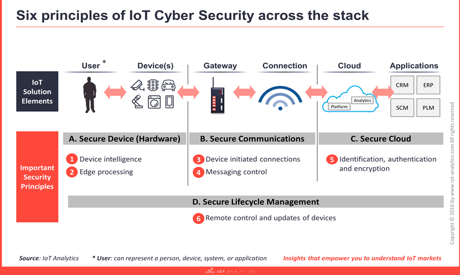